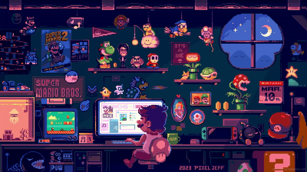

<h1 align="center"> cout << "Hello World!👋" << endl;
</h1>

<!--
**gabmartinbr/gabmartinbr** is a ✨ _special_ ✨ repository because its `README.md` (this file) appears on your GitHub profile.

Here are some ideas to get you started:
-->
- 🔭 I’m currently studying in ***University of La Laguna*** 
- 🌱 I’m currently learning mobile apps development 
- 📫 How to reach me: [***student***](mailto:alu0101539157@ull.edu.es) or [***personal***](gabriel04mb@gmail.com)
- ⚡ Fun fact: trying to survive uni

### Currently using:    

 

