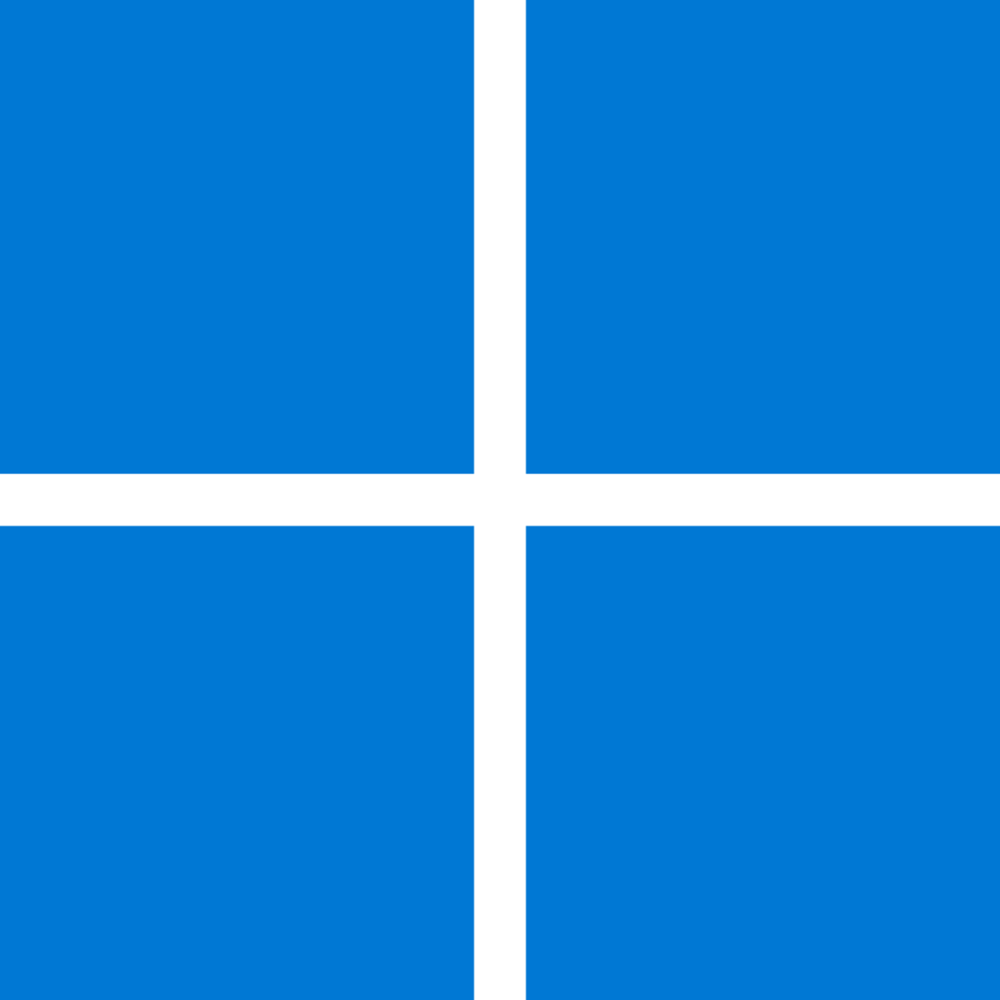

<h1 align="center"> cout << "Hello World!👋" << endl;
</h1>

<!--
**gabmartinbr/gabmartinbr** is a ✨ _special_ ✨ repository because its `README.md` (this file) appears on your GitHub profile.

Here are some ideas to get you started:
-->
- 🔭 Currently studying at ***University of La Laguna*** 
- 🌱 Currently learning pentesting CTF 
- 📫 How to reach me: [***personal mail***](mailto:alu0101539157@ull.edu.com)
- ⚡ Fun fact: always core dump, always...
 

   &nbsp;&nbsp;
   &nbsp;&nbsp;
  

<h3 align="left">Languages and Tools:</h3>

  
  
  
  
  
  
  
  
  
  

